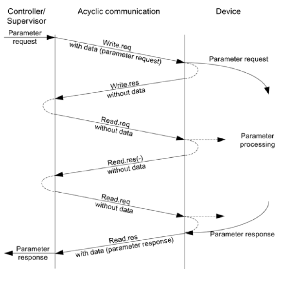

# Drive Functions

## Overview

The function blocks within the LAcycCom library facilitate communication with drive objects via DPV1 services. Specifically, they enable reading and writing of freely configurable parameter datasets using dataset 47 (asynchronous data exchange).

The process involves:

- Parameter Request: The user configures and sends a parameter request (read or write).
- Parameter Processing: The drive device processes the request.
- Parameter Response:
  - Success: A positive response is sent upon successful processing.
  - Error: If an error occurs, a specific error value indicating the cause is set in the response telegram.

Beyond basic parameter access, LAcycCom offers additional high-level functionalities for drive objects:

- Drive Object Control: Deactivation and activation of SINAMICS S120 drive objects and their components (e.g., power units, encoders).
- Parameter Persistence: Saving drive object parameters to non-volatile memory (RAM2ROM).
- Simplified Integration: For these higher-level functionalities, the LAcycCom_HandleResource function block is often not directly required by the user, as correct handling of request buffers and resources is already integrated within them.

> NOTE
>
> As of LAcycCom V1.5 (this referes to the library for TIA Portal), Base Mode Parameter Access - Local (dataset 0xB02E) is supported when using PROFINET. This simplifies addressing, as the drive object is identified solely via its hardware identifier, eliminating the need for a separate drive object identifier. For new projects, setting the input parameter driveObjectId of the LAcycCom function blocks to -1 (default) is the recommended approach for this type of access.

## Principle of Operation

The followig figure shows the principle of acyclic data exchange. The user sends the request for the specified parameters in the dataset to the device. This can be either a writing or reading request. When the parameter request was processed by the device, it sends an acknowledgement back. The requested parameters can be no either accessed to read or write their values. When this second request was processed by the device, it sends again an acknoledgement back to the controller. If an error occurs during the communication or processing of parameters, a specific error value will be set in the response telegram. All function blocks of the Drive Function are following this principle to exchange data via a drive system additionally utilizing the [Resourece Management](../resource_management/index.md).

## Content

### Function blocks

| Name                     | Description           |
| ------------------------ | --------------------- |
| [LAcycCom_AckDriveFaults](blocks/LAcycCom_AckDriveFaults.md) | Function block to acknowledge faults at a drive object |
| [LAcycCom_DriveActDeact](blocks/LAcycCom_DriveActDeact.md) | Function block to activate or deactivate drive objects in the SINAMICS control unit |
| [LAcycCom_DriveComponentsActDeact][DriveComponentsActDeact] | Function block to activate or deactivate drive object components (power unit and encoders) in the SINAMICS control unit |
| [LAcycCom_DriveRamToRom](blocks/LAcycCom_DriveRamToRom.md) | Function block to save the volatile RAM data of specified drive object to the retentive ROM |
| [LAcycCom_ReadDriveMessagesDateTime](blocks/LAcycCom_ReadDriveMessagesDateTime.md) | Function block to read active messages (alarms, fault and SI messages), sorted by time from a drive object |
| [LAcycCom_ReadDriveMessagesOperatingHours](blocks/LAcycCom_ReadDriveMessagesOperatingHours.md) | Function block to read active messages (alarms and faults), sorted by time from a G120 control unit |
| [LAcycCom_ReadDriveParams](blocks/LAcycCom_ReadDriveParams.md) | Function block to read multiple parameters via a dataset from a SINAMICS drive object |
| [LAcycCom_ReadDriveSingleParam](blocks/LAcycCom_ReadDriveSingleParam.md) | Function block to read a single parameter from a SINAMICS drive object |
| [LAcycCom_RTCSinamics](blocks/LAcycCom_RTCSinamics.md) | Function block to synchronize the clock of a SINAMICS control unit with the clock of the SIMATIC controller (with ping compensation)  |
| [LAcycCom_RTCSinamicsAcyclic](blocks/LAcycCom_RTCSinamicsAcyclic.md) | Function block to synchronize the clock of a SINAMICS control unit with the clock of the SIMATIC controller (with acyclic data exchange) |
| [LAcycCom_WriteDriveParams](blocks/LAcycCom_WriteDriveParams.md) | Function block to write multiple parameters via a dataset from a SINAMICS drive object |
| [LAcycCom_WriteDriveSingleParam](blocks/LAcycCom_WriteDriveSingleParam.md) | Function block to write a single parameter from a SINAMICS drive object |

### Enums

| Name                     | Description           |
| ------------------------ | --------------------- |
| [LAcycCom_DatatypeSelector](enums/LAcycCom_DatatypeSelector.md) | Contains possible data types used to specify the target value in the dataset type [LAcycCom_DriveDataset][TypeDriveDataset] |
| [LAcycCom_DriveComponentMode](enums/LAcycCom_DriveComponentMode.md) | Contains the different modes of a drive object that can be controlled via [LAcycCom_DriveComponentsActDeact][DriveComponentsActDeact] |
| [LAcycCom_DriveFunctionStatus](enums/LAcycCom_DriveFunctionStatus.md) | Contains the status values for the drive functions |
| [LAcycCom_DriveMessageType](enums/LAcycCom_DriveMessageType.md) | Contains the message types that are retrieved from the drive via LAcycCom_ReadDriveMessagesDateTime and LAcycCom_ReadDriveMessagesOperatingHours |

### Data Types

| Name                     | Description           |
| ------------------------ | --------------------- |
| [LAcycCom_typeDriveDataset][TypeDriveDataset] | Defines a data structure that is used as a dataset to read/write parameters to a SINAMICS drive object |
| [LAcycCom_typeDriveDiagnostics](types/LAcycCom_typeDriveDiagnostics.md) | Defines a data structure that is used by drive functions to provide detailed diagnostics about the function block or internal states and error values of the drive state |
| [LAcycCom_typeDriveMessage](types/LAcycCom_typeDriveMessage.md) | Defines a data structure that contains information about messages (alarms, faults SI messages) from a SINAMICS drive object |

[TypeDriveDataset]: types/LAcycCom_typeDriveDataset.md
[DriveComponentsActDeact]: blocks/LAcycCom_DriveComponentsActDeact.md
