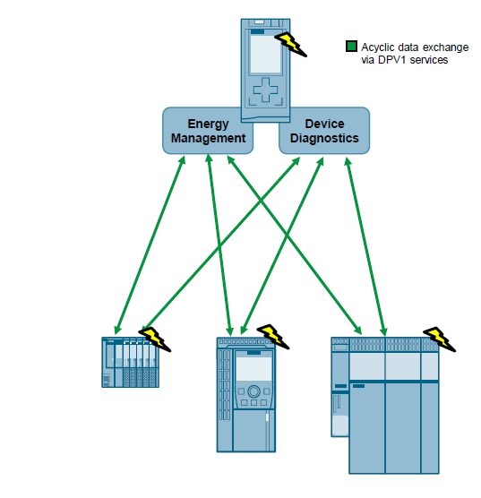
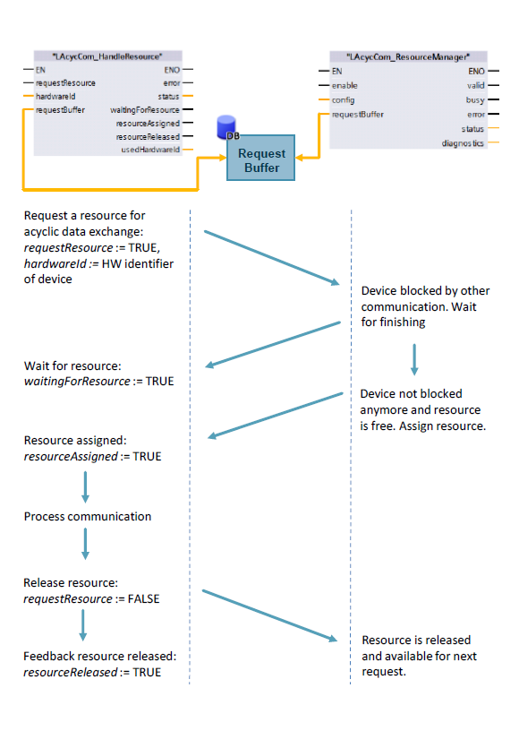

# Resource Management

## Overview

In modern industrial automation, particularly within Siemens S7-1200/1500 PLCs, both cyclic and acyclic communication are critical. While cyclic communication handles continuous, time-synchronous data exchange, acyclic communication is vital for event-driven, less frequent tasks such such as parameter adjustments, diagnostic queries, or configuration updates.

A significant challenge emerges when multiple program components or communication requests concurrently attempt to utilize the same shared communication resource (e.g., a DPV1 channel). Without a coordinated access mechanism, this can lead to:

- Communication Collisions: Simultaneous access attempts to a single resource.
- Data Integrity Issues: Incomplete or corrupted data transfers.
- System Instability: Unpredictable behavior, communication timeouts, or even PLC operational halts.
- Performance Degradation: Increased network traffic and delays due to repeated transmission attempts.

To prevent these issues, a centralized Resource Management strategy is implemented. The core principle is to establish a single, authoritative control point that arbitrates access to shared acyclic communication resources. This ensures that only one request can actively use a resource at any given moment, thereby preventing conflicts and guaranteeing orderly execution.

## Principle of Operation

The following figure shows the functionality of the function block [HandleResource][HandleResource] in combination with the function block [ResourceManager][ResourceManager]. The function block [HandleResource][HandleResource] allows the user to request a resource for acyclic data exchange by registering it via the Request Buffer to the function block [ResourceManager][ResourceManager]. When the requested resource for the acyclic communication is no longer needed, it should be released via the function block [HandleResource][HandleResource].

## Content

### Function blocks

| Name                     | Description           |
| ------------------------ | --------------------- |
| [ResourceManager][ResourceManager] | Function block to manage state of multiple arbitrary resources |
| [HandleResource][HandleResource] | Function block for user programmed blocks to request the state of a resource centrally managed in the resource manager |

### Enums

| Name                     | Description           |
| ------------------------ | --------------------- |
| [ResourcesConstants](enums/LAcycCom_ResourcesConstants.md) | Contains constants to determine certain quantity structures of the application |
| [ResourcesStatus](enums/LAcycCom_ResourcesStatus.md) | Contains the status values for the resource management function blocks |

### Data Types

| Name                     | Description           |
| ------------------------ | --------------------- |
| [typeActiveRequest](types/LAcycCom_typeActiveRequest.md) | Defines a data structure to describe an element from the active requests stored in the header of the buffer |
| [typeRequestBufferElement](types/LAcycCom_typeRequestBufferElement.md) | Defines a data structure to describe an element from the buffer used by this appliaction to share and manage state of resources |
| [typeRequestBufferHeader](types/LAcycCom_typeRequestBufferHeader.md) | Defines a data structure to control and provide information of the buffer used by this appliaction to share and manage state of resources |
| [typeResourceManagerConfiguration](types/LAcycCom_typeResourceManagerConfiguration.md) | Defines a data structure to describe configuration parameter for the resource management |
| [typeResourceManagerDiagnostics](types/LAcycCom_typeResourceManagerDiagnostics.md) | Defines a data structure to provide diagnostics about the resource manager |

[ResourceManager]: blocks/LAcycCom_ResourceManager.md
[HandleResource]: blocks/LAcycCom_HandleResource.md
